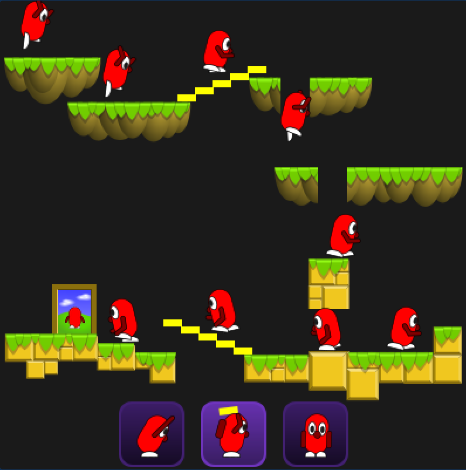

# 🎮 Puzzle Platformer 

A handcrafted puzzle platformer where you rescue adorable creatures by assigning them special skills to change their world.

## Overview

Guide the creatures to the exit by using their unique powers to reshape the landscape. Every level is a brain-teasing mix of platforming, timing, and clever skill assignments.


▶️ [Try it now](https://joern-kalz.github.io/puzzle-platformer/)

## 📸 Screenshot 



## 🛠️ Development Setup 

Build and run the game locally.

### Prerequisites

Install [Rust](https://rust-lang.org/).

Install the required Rust tools:

```sh
cargo install wasm-bindgen-cli miniserve cargo-watch
```

Enable the WebAssembly compilation target:

```sh
rustup target add wasm32-unknown-unknown
```

### Build

Build the WebAssembly binary:

```sh
cargo build --target wasm32-unknown-unknown
```

Generate JavaScript glue code:

```sh
wasm-bindgen target/wasm32-unknown-unknown/debug/puzzle_platformer.wasm \
    --out-dir ./pkg \
    --target web
```

### Run Locally

Serve the project locally:

```sh
miniserve . --index index.html -p 8080
```

Open [http://localhost:8080/](http://localhost:8080/) in your browser.

### Watch for Changes

Automatically rebuild on file changes:

```sh
cargo watch -c -i pkg/ -s "cargo build --target wasm32-unknown-unknown && wasm-bindgen target/wasm32-unknown-unknown/debug/puzzle_platformer.wasm --out-dir ./pkg --target web"
```

## Run Tests

Run tests:

```sh
cargo test
```

Generate screenshots at key frames of integration tests:

```sh
DEBUG=true cargo test
```

## Contributing

Contributions, bug reports, and level ideas are welcome. Feel free to open an issue or submit a pull request.

## License 📄

See [LICENSE](./LICENSE)
